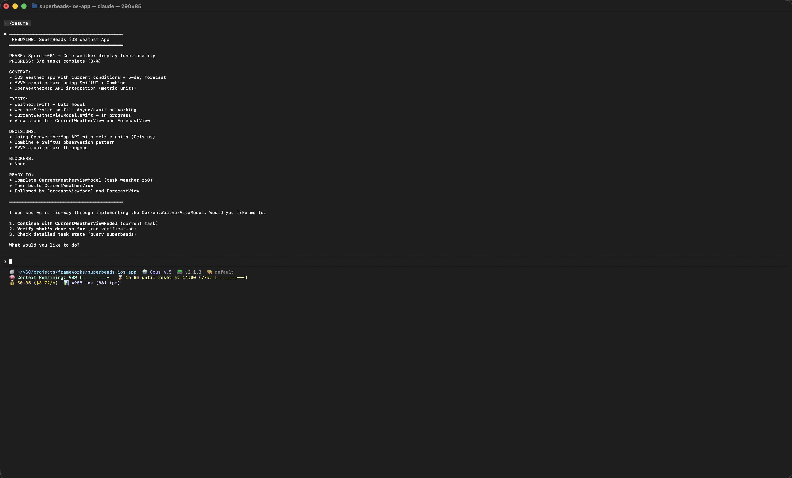
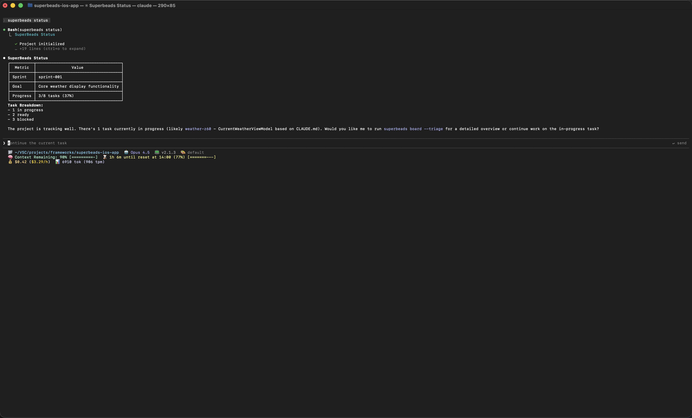
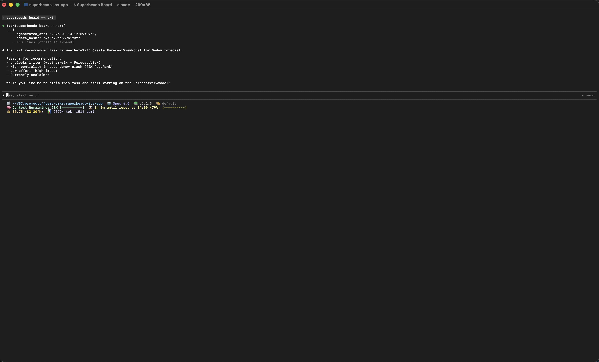
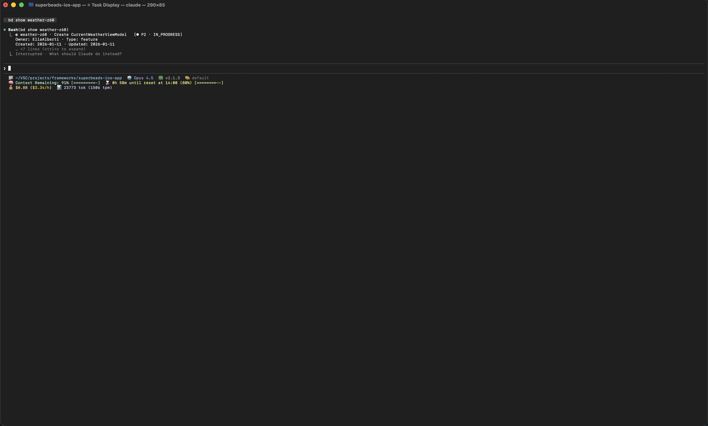
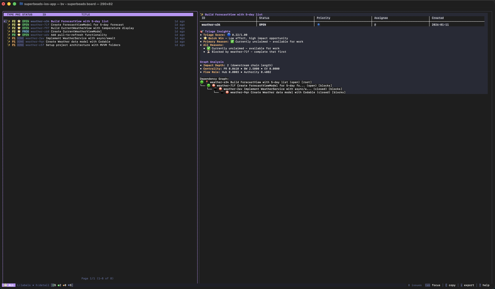
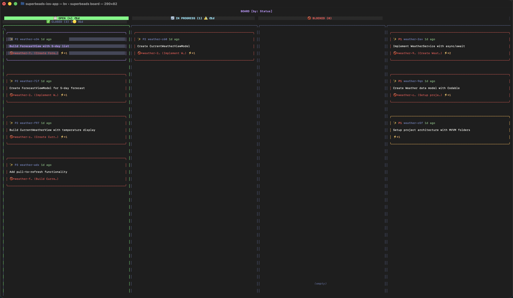
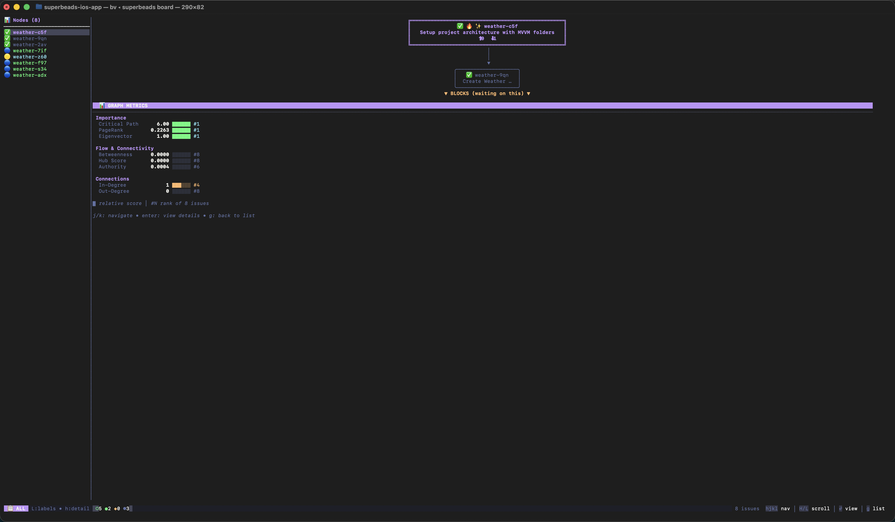
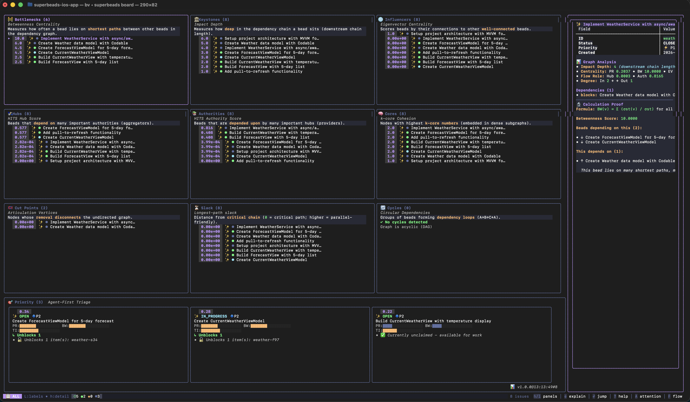

<p align="center">
  
  
  
  
</p>

<h1 align="center">SuperBeads Universal Framework</h1>
<h3 align="center"><em>with Wiggum Flavour</em></h3>

<p align="center">
  <strong>A systematic methodology for Claude Code that transforms AI collaboration into structured, verifiable productivity.</strong>
</p>

<p align="center">
  <a href="#screenshots">Screenshots</a> •
  <a href="#installation">Installation</a> •
  <a href="#key-features">Features</a> •
  <a href="#quick-start">Quick Start</a> •
  <a href="#how-it-works">How It Works</a> •
  <a href="#domain-packs">Packs</a> •
  <a href="#faq">FAQ</a> •
  <a href="#credits">Credits</a>
</p>

---

## Screenshots

### Claude Code Integration

<table>
  <tr>
    <td align="center"><strong>Session Start</strong><br/><br/><em>/resume loads project context</em></td>
    <td align="center"><strong>Project Status</strong><br/><br/><em>superbeads status overview</em></td>
  </tr>
  <tr>
    <td align="center"><strong>AI Recommendation</strong><br/><br/><em>Smart task prioritization</em></td>
    <td align="center"><strong>Task Details</strong><br/><br/><em>Full task information</em></td>
  </tr>
  <tr>
    <td align="center" colspan="2"><strong>Session End</strong><br/><br/><em>/wrapup saves progress</em></td>
  </tr>
</table>

### Visual Task Board (TUI)

<table>
  <tr>
    <td align="center"><strong>Task Board</strong><br/><br/><em>Interactive task viewer</em></td>
    <td align="center"><strong>Kanban View</strong><br/><br/><em>Visual workflow columns</em></td>
  </tr>
  <tr>
    <td align="center"><strong>Dependency Graph</strong><br/><br/><em>Task relationships</em></td>
    <td align="center"><strong>Insights Dashboard</strong><br/><br/><em>Project health metrics</em></td>
  </tr>
</table>

---

## Installation

### Prerequisites

- Claude Code CLI
- Git (recommended for version control)
- Domain-specific tools as needed (Xcode, Node, Python, etc.)

### Step 1: Install the Framework

```bash
# Clone the repository
git clone https://github.com/EliaAlberti/superbeads-universal-framework.git
cd superbeads-universal-framework

# Run the installer (adds CLI to PATH automatically)
./core/scripts/install-superbeads.sh

# Restart your shell or run:
source ~/.zshrc  # or ~/.bashrc

# Verify installation
superbeads --version
```

The installer:
- Copies core files to `~/.superbeads/`
- Adds `superbeads` CLI to your PATH
- Works across all terminal sessions

### Step 2: Initialize Your Project

```bash
cd your-project

# Initialize (also installs task tracking tools)
superbeads init

# Optionally add a domain pack
superbeads pack install python  # Or: ios, web, design, pm
```

**Installed automatically during `superbeads init`:**
- Task tracking CLI (bd) - for task management
- Task board viewer (bv) - for visual project management TUI

### What Gets Created

```
your-project/
├── CLAUDE.md              # Project memory (persists across sessions)
├── .beads/                # Task tracking database
├── .superbeads/           # Sprint tracking and settings
│   ├── sprint/
│   └── agents/            # (after pack install)
├── verify.sh              # Verification script
└── scripts/               # (after pack install)
    └── verify.sh          # Domain-specific verification
```

### Mid-Project Adoption

SuperBeads is designed for mid-project adoption. The initialization is non-destructive-it only adds files and never modifies your existing code.

```bash
cd existing-project
superbeads init  # Safe to run anytime
```

---

## Key Features

### Session Memory
- **CLAUDE.md** persists project context across sessions
- `/resume` loads context + recent session logs, supports topic search
- `/preserve` saves progress, auto-archives when CLAUDE.md exceeds 280 lines
- `/compress` saves searchable session logs before `/compact`
- No more re-explaining your project every time

### Atomic Git Commits
- One commit per task with task ID reference
- Clean, traceable history
- Easy rollback if something breaks
- Format: `✓ task-007: Password validation`

### Observable Verification
- Every task has a verifiable completion signal
- Build passes, tests green, file exists, checklist done
- "It looks done" is never good enough
- Domain packs include customized `verify.sh` scripts

### Cost Optimization
- Strategist/Executor/Specialist default to Sonnet (handles 95%+ of tasks excellently)
- Critic defaults to Haiku for reviews (5x cost savings)
- **Models are fully customizable** - upgrade to Opus for complex work, or use Haiku for budget projects
- See [Model Configuration](GUIDE.md#model-configuration) for when and how to change models

### Sprint Tracking
- Group tasks into sprints with goals
- Track progress: "23/30 tasks (77%)"
- Log learnings for future sessions
- Close sprints with summaries

### Task Board & Visualization
- Interactive TUI with Kanban columns, dependency graphs
- Health score, bottleneck detection, project insights
- Robot protocol for AI agents (machine-readable JSON)
- `superbeads board` opens visual project management

### Four-Agent Architecture
- **Strategist**: Plans, breaks down work
- **Executor**: Builds deliverables
- **Specialist**: Handles complex domain details
- **Critic**: Reviews, verifies quality

### Task Discipline
- 10-15 minute tasks (optimal AI collaboration unit)
- No "and" in title (single responsibility)
- 3-5 acceptance criteria per task
- Observable completion signal

### Domain Packs
- 5 available: iOS, Python, Web, Design, PM
- 4 specialized agents per pack
- 9 production-ready skills per pack
- Domain-specific verification

---

## Quick Start

Choose the approach that fits your needs:

### Option 1: Minimal Setup (2 minutes)

If you just want session memory without the full framework, create a `CLAUDE.md` file:

```bash
cat > CLAUDE.md << 'EOF'
# Project Name

## Context
What this project does and its current state.

## Current Focus
What you're working on right now.

## Next Steps
What comes after the current work.

*Use /resume to start sessions, /preserve to end them*
EOF
```

Start every Claude Code session with `/resume`. This alone provides persistent context across sessions-often the highest-value improvement you can make.

### Option 2: Full Framework

```bash
superbeads init
superbeads pack install python  # Optional: add a domain pack
```

### Option 3: Core Only (No Pack)

The Core Engine provides full value without any domain pack. It works for any type of task-code, documentation, research, planning. See [Using Core Alone](./core/docs/USING-CORE-ALONE.md).

---

## The Problem

Most AI coding sessions fail not because the AI lacks capability, but because the collaboration lacks structure:

| Problem | Impact |
|---------|--------|
| Context lost between sessions | Repeated explanations, lost progress |
| Vague task definitions | Scope creep, unclear completion |
| No verification standard | "Looks done" vs. actually done |
| AI attempts everything at once | Inconsistent quality, errors compound |
| Invisible progress | No way to measure or resume |

SuperBeads addresses each systematically:

| Problem | Solution |
|---------|----------|
| Context lost | CLAUDE.md persists project state |
| Vague tasks | 10-15 min atomic tasks with criteria |
| No verification | Observable completion signals |
| Unfocused AI | Specialized agents per thinking mode |
| Invisible progress | Sprint tracking with metrics |

---

## How It Works

SuperBeads is built on four patterns:

```
┌─────────────────────────────────────────────────────────────────────┐
│                         THE SUPERBEADS MODEL                        │
├─────────────────────────────────────────────────────────────────────┤
│                                                                     │
│   ┌───────────────┐    ┌───────────────┐    ┌───────────────┐      │
│   │  STRATEGIST   │───▶│   EXECUTOR    │───▶│    CRITIC     │      │
│   │   (Plan)      │    │   (Build)     │    │   (Review)    │      │
│   └───────────────┘    └───────────────┘    └───────────────┘      │
│          │                    │                    │                │
│          ▼                    ▼                    ▼                │
│   ┌───────────────┐    ┌───────────────┐    ┌───────────────┐      │
│   │ Task Breakdown│    │ Skill-Based   │    │ Verification  │      │
│   │ (10-15 min)   │    │ Implementation│    │ Before Done   │      │
│   └───────────────┘    └───────────────┘    └───────────────┘      │
│                                                                     │
│                    SESSION MEMORY (CLAUDE.md)                       │
│                    Context that survives restarts                   │
│                                                                     │
└─────────────────────────────────────────────────────────────────────┘
```

### The Four Pillars

| Pillar | Problem It Solves | How It Works |
|--------|-------------------|--------------|
| **Agentic Architecture** | AI tries to do everything at once | Four specialized roles: Strategist plans, Executor builds, Specialist handles complexity, Critic reviews |
| **Task Discipline** | Large tasks drift and never complete | 10-15 min tasks, no "and" in title, observable output |
| **Verification Framework** | "Looks done" ≠ done | Every task has verifiable signal: build, test, file, checklist |
| **Session Protocols** | Context lost between sessions | /resume to start, /preserve to end |

### The Four Agents

| Agent | WHY | WHAT | WHEN | HOW |
|-------|-----|------|------|-----|
| **Strategist** | AI performs poorly when trying to plan and build simultaneously | Plans approach, breaks work into 10-15 min tasks with criteria | Start of features, sprint planning, when scope is unclear | Analyzes requirements, identifies dependencies, creates task breakdown |
| **Executor** | Implementation needs focus, not divided attention | Builds actual deliverables using skills | After strategist creates tasks | Loads relevant skill, implements, verifies, commits |
| **Specialist** | Some problems need deep domain expertise | Handles complex domain-specific challenges | Complex UI, performance issues, advanced patterns | Applies specialized knowledge (animations, async, accessibility) |
| **Critic** | Self-review is unreliable; fresh eyes catch issues | Reviews output, verifies quality | Before marking any task complete | Checks against criteria, runs verification, flags issues |

**Cost optimization**: Strategist, Executor, and Specialist use Sonnet. Critic uses Haiku (5x cheaper)-reviews don't need full reasoning capability.

### Task Discipline

The 10-15 minute rule is the optimal unit for AI collaboration:
- **Large enough** to be meaningful work
- **Small enough** to verify completely
- **Recoverable** if something goes wrong (minutes lost, not hours)
- **Focused** enough to maintain AI context efficiency

| Rule | WHY | Example |
|------|-----|---------|
| **10-15 minutes** | Completable without context degradation | "Create login form" not "Build auth system" |
| **No "and" in title** | Single responsibility prevents scope creep | "Add email field" not "Add email and password fields" |
| **3-5 acceptance criteria** | Clear, testable definition of done | "Email validates format", "Error shows on invalid" |
| **Observable completion** | Verifiable, not subjective | "Preview shows working form" not "Form looks good" |
| **One commit** | Clean history, easy rollback | `✓ task-007: Login form email field` |

**Example - Wrong vs Right:**

```
❌ "Implement user authentication system"
   → Too large, unclear scope, multiple concerns, hard to verify

✅ "Create login form with email validation"
   Criteria:
   - Email field with format validation
   - Error message displays on invalid input
   - Form disables submit until valid
   Completion: Preview shows working validation
   Commit: ✓ task-001: Login form email validation
```

### Verification Framework

Every task needs a verifiable completion signal. The type depends on the work:

| Type | WHEN to use | HOW it works | Example |
|------|-------------|--------------|---------|
| **Build passes** | Code projects | Run build command, check exit code | `npm build` exits 0 |
| **Tests pass** | Code with tests | Run test suite, all green | `pytest` shows 100% pass |
| **Output exists** | Any deliverable | Check file at expected path | `ls exports/hero.png` |
| **API succeeds** | Integration work | Hit endpoint, check response | POST returns 201 |
| **Checklist complete** | Non-code work | All criteria objectively verified | All 5 criteria checked |

---

## Daily Usage

### CLI Commands

```bash
# Project
superbeads init                              # Initialize project (installs task tracking)
superbeads status                            # Project overview with health score

# Tasks
superbeads task create                       # Create task (interactive)
superbeads task list                         # List all tasks
superbeads task show bd-abc123               # Task details
superbeads task complete bd-abc123           # Mark complete

# Task Board (TUI visualization)
superbeads board                             # Open interactive task board
superbeads board --triage                    # Project overview (JSON for agents)
superbeads board --next                      # Next recommended task
superbeads board --alerts                    # Problems and warnings

# Sprints
superbeads sprint start "Sprint name"        # Start sprint
superbeads sprint status                     # Sprint progress
superbeads sprint close                      # Close sprint

# Packs
superbeads pack list                         # Available packs
superbeads pack install <pack>               # Install pack
superbeads pack info <pack>                  # Pack details

# Verification
superbeads verify                            # Run verification
```

### Task Board

The built-in task board provides visual project management:

```bash
superbeads board
```

> **Note:** On first launch, you may see "Enhance AI Agent Integration?" prompt. Select **"No thanks"** - SuperBeads provides its own comprehensive agent context through CLAUDE.md and the agent system. The generic beads_viewer instructions are not needed.

**Keyboard shortcuts (in TUI):**

| Category | Key | Action |
|----------|-----|--------|
| **Views** | `b` | Kanban board |
| | `g` | Graph view (dependencies) |
| | `i` | Insights (health, metrics) |
| | `h` | History view |
| | `a` | Actionable tasks |
| | `f` | Flow matrix |
| | `[` | Label dashboard |
| | `]` | Attention view |
| **Navigation** | `j/↓` | Move down |
| | `k/↑` | Move up |
| | `G/end` | Go to last |
| | `Enter` | View details |
| | `Esc` | Back / close |
| **Filters** | `/` | Fuzzy search |
| | `o` | Open issues |
| | `c` | Closed issues |
| | `r` | Ready (unblocked) |
| | `l` | Filter by label |
| | `s` | Cycle sort |
| | `S` | Triage sort |
| **Actions** | `p` | Priority hints |
| | `t` | Time-travel |
| | `x` | Export markdown |
| | `C` | Copy to clipboard |
| | `O` | Open in editor |
| **Global** | `?` | Help / shortcuts |
| | `!` | Alerts panel |
| | `q` | Quit |

**For agents (machine-readable):**

| Command | Purpose | Use case |
|---------|---------|----------|
| `--triage` | Project overview | Session start, planning |
| `--next` | Next recommended task | Task selection |
| `--plan` | Sprint planning data | Sprint setup |
| `--insights` | Metrics, bottlenecks | Health monitoring |
| `--alerts` | Problems and warnings | Review, debugging |

### Session Commands

| Command | WHEN | WHAT it does |
|---------|------|--------------|
| `/resume` | Start of every session | Reads CLAUDE.md + recent session logs, supports topic search (`/resume 5 auth`) |
| `/preserve` | End of session | Updates CLAUDE.md with progress, auto-archives when >280 lines |
| `/wrapup` | Quick end | Summary + optional CLAUDE.md update |
| `/compress` | Before `/compact` | Saves searchable session log to CC-Session-Logs/ with AI keywords |

**Session logs** are saved to `{project}/CC-Session-Logs/` and enable `/resume` to search past sessions by topic.

### Session Flow Example

```
SESSION START
─────────────
$ claude
> /resume

Claude reads CLAUDE.md, checks task board:
$ superbeads board --triage
→ Sprint: User authentication (60%)
→ 4 tasks remaining, 1 ready

$ superbeads board --next
→ task-007: Password validation (ready, no blockers)

"Project: Your App
 Progress: 6/10 tasks (60%)
 Sprint: User authentication
 Ready: task-007 (Password validation)"

WORK
────
You: "Continue with task-007"

Claude executes task:
→ task-007: Password validation (12 min)
  - Implemented validation logic
  - Verified: Tests pass ✓
  - Committed: "✓ task-007: Password validation"

$ superbeads board --next
→ task-008: Auth API integration (ready)

→ task-008: Auth API integration (15 min)
  - Connected to auth endpoint
  - Verified: API returns 200 ✓
  - Committed: "✓ task-008: Auth API call"

SESSION END
───────────
You: "/preserve"

Claude updates CLAUDE.md:
- Progress: 8/10 (80%)
- Learnings: "JWT refresh needs error handling"
- Next: task-009 (Error states)
```

---

## Domain Packs

Domain packs are optional accelerators. The Core Engine works for any task-packs add domain expertise.

| Pack | Domain | Agents | Skills |
|------|--------|--------|--------|
| `ios` | Swift/SwiftUI | 4 | 9 |
| `python` | Python | 4 | 9 |
| `web` | React/Next.js | 4 | 9 |
| `design` | Product Design | 4 | 9 |
| `pm` | Product Management | 4 | 9 |

---

<details>
<summary><strong>iOS Pack</strong> - Swift/SwiftUI Development</summary>

### WHY use this pack?

Building iOS apps without structure leads to inconsistent architecture, accessibility oversights, and magic numbers instead of design tokens. The iOS pack ensures every view, viewmodel, and model follows production patterns.

### WHAT it provides

**4 Agents:**

| Agent | Role | Example Use |
|-------|------|-------------|
| `ios-strategist` | Architecture decisions, task breakdown | "Break down settings screen into MVVM tasks" |
| `ios-executor` | Implementation using skills | "Create SettingsView following ios-create-view skill" |
| `ios-specialist` | Complex UI, animations, accessibility | "Implement custom chart with VoiceOver support" |
| `ios-critic` | Review agnst iOS standards | "Verify accessibility labels, Dynamic Type support" |

**9 Skills:**

| Skill | WHY | WHEN to use | WHAT it creates |
|-------|-----|-------------|-----------------|
| `ios-create-view` | Consistent, accessible UI | Any new screen or component | SwiftUI view with accessibility, previews, design tokens |
| `ios-create-viewmodel` | Proper state management | Business logic for views | ViewModel with Combine, @Published, error handling |
| `ios-create-model` | Type-safe data | Data structures | Codable model with validation |
| `ios-setup-navigation` | Consistent routing | App navigation structure | NavigationStack with deep linking |
| `ios-networking` | Reliable API calls | Any API integration | URLSession + Combine layer |
| `ios-setup-subscription` | Correct IAP handling | In-app purchases | StoreKit 2 implementation |
| `ios-create-widget` | Home screen presence | Widgets | WidgetKit widget |
| `ios-setup-architecture` | Clean structure | New projects | MVVM folder structure |
| `ios-setup-storage` | Local persistence | Data storage | Core Data or SwiftData |

### WHEN to use

- Building new iOS/iPadOS apps
- Adding features to existing Swift projects
- Need consistent MVVM architecture
- Want accessibility built-in from start

### HOW - Real Example

```
You: "Add a settings screen with dark mode toggle"

# Strategist checks current state
$ superbeads board --triage
→ Sprint: Core features (45%), 5 tasks open

ios-strategist breaks down:
├── task-006: SettingsView layout (10 min)
│   Skill: ios-create-view
│   Criteria: Section headers, grouped list style, accessibility
│
├── task-007: SettingsRow component (12 min)
│   Skill: ios-create-view
│   Criteria: Reusable, supports toggle/navigation/value types
│
├── task-008: DarkModeToggle with system binding (10 min)
│   Skill: ios-create-view
│   Criteria: Binds to @AppStorage, updates immediately
│
├── task-009: SettingsViewModel (12 min)
│   Skill: ios-create-viewmodel
│   Criteria: Manages preferences, persists to UserDefaults
│
└── task-010: Navigation from profile (8 min)
    Skill: ios-setup-navigation
    Criteria: Push transition, back button works

# Executor picks next task
$ superbeads board --next
→ task-006: SettingsView layout (ready)

Each task: Verified with xcodebuild → Committed with task ID
```

### Verification

```bash
xcodebuild -scheme App -destination 'platform=iOS Simulator,name=iPhone 15' build test
```

### Install

```bash
superbeads pack install ios
```

</detls>

---

<detls>
<summary><strong>Python Pack</strong> - Python Development</summary>

### WHY use this pack?

Python's flexibility can lead to inconsistent code-missing type hints, no tests, APIs without validation. The Python pack enforces modern practices: full typing, comprehensive tests, clean architecture.

### WHAT it provides

**4 Agents:**

| Agent | Role | Example Use |
|-------|------|-------------|
| `python-strategist` | Module architecture, dependencies | "Plan user service with repository pattern" |
| `python-executor` | Implementation with types and tests | "Create UserService following python-create-class" |
| `python-specialist` | Asyncio, performance, metaprogramming | "Optimize database queries with async batching" |
| `python-critic` | Review with ruff, mypy, pytest | "Verify type coverage, test coverage, style" |

**9 Skills:**

| Skill | WHY | WHEN to use | WHAT it creates |
|-------|-----|-------------|-----------------|
| `python-create-module` | Proper package structure | New functionality area | Package with `__init__.py`, exports |
| `python-create-class` | Type-safe, testable code | Domn logic | Class/dataclass with full typing |
| `python-create-api` | Production API endpoints | REST endpoints | FastAPI/Flask route with validation |
| `python-setup-project` | Consistent tooling | New projects | pyproject.toml, tool configs |
| `python-testing` | Reliable code | Any implementation | pytest tests with fixtures |
| `python-data-models` | Validated data | Request/response schemas | Pydantic models |
| `python-database` | Clean data access | Database operations | SQLAlchemy with async |
| `python-cli` | Command-line tools | CLI applications | Typer app with help |
| `python-async` | Concurrent operations | I/O-bound work | asyncio patterns |

### WHEN to use

- Building Python applications or libraries
- Creating REST APIs (FastAPI/Flask)
- Need enforced type hints throughout
- Want comprehensive test coverage

### HOW - Real Example

```
You: "Create a REST API for user management"

# Strategist checks current state
$ superbeads board --triage
→ Sprint: API development (30%), 3 tasks open

python-strategist designs:
├── task-004: User Pydantic models (12 min)
│   Skill: python-data-models
│   Criteria: UserCreate, UserUpdate, UserResponse with validation
│
├── task-005: User SQLAlchemy model (10 min)
│   Skill: python-database
│   Criteria: User table, relationships, indexes
│
├── task-006: UserRepository (12 min)
│   Skill: python-create-class
│   Criteria: CRUD operations, async, proper typing
│
├── task-007: User API endpoints (15 min)
│   Skill: python-create-api
│   Criteria: GET/POST/PATCH/DELETE, proper status codes, OpenAPI docs
│
└── task-008: User endpoint tests (15 min)
    Skill: python-testing
    Criteria: Happy path, validation errors, not found cases

# Executor picks next task
$ superbeads board --next
→ task-004: User Pydantic models (ready)

Each task: Verified with ruff+mypy+pytest → Committed with task ID
```

### Verification

```bash
ruff check . && ruff format --check . && mypy . && pytest --cov
```

### Install

```bash
superbeads pack install python
```

</detls>

---

<detls>
<summary><strong>Web Pack</strong> - React/Next.js Development</summary>

### WHY use this pack?

Web projects easily become tangled-mixed server/client components, prop drilling, forms without validation. The Web pack enforces React best practices with proper patterns throughout.

### WHAT it provides

**4 Agents:**

| Agent | Role | Example Use |
|-------|------|-------------|
| `web-strategist` | Component architecture, data flow | "Plan dashboard with server components" |
| `web-executor` | React/TypeScript implementation | "Create DataTable following web-create-component" |
| `web-specialist` | Performance, animations, a11y | "Implement virtualized list with 10k items" |
| `web-critic` | ESLint, TypeScript, Vitest | "Verify no any types, proper key props" |

**9 Skills:**

| Skill | WHY | WHEN to use | WHAT it creates |
|-------|-----|-------------|-----------------|
| `web-create-component` | Consistent, typed components | Any UI element | React component with TypeScript |
| `web-create-page` | Proper Next.js patterns | Routes | Page with data fetching |
| `web-create-hook` | Reusable logic | Shared behavior | Custom hook with proper deps |
| `web-setup-project` | Consistent config | New projects | Next.js with tooling |
| `web-testing` | Reliable components | Any component | Vitest + Testing Library |
| `web-state-management` | Proper data flow | Complex state | React Query + Zustand |
| `web-api-routes` | Type-safe APIs | Backend logic | Route Handler with validation |
| `web-forms` | Validated input | User input | React Hook Form + Zod |
| `web-styling` | Consistent design | Styling | Tlwind patterns |

### WHEN to use

- Building React/Next.js applications
- Need proper TypeScript throughout
- Want tested, accessible components
- Using server components correctly

### HOW - Real Example

```
You: "Build a contact form with validation"

# Strategist checks current state
$ superbeads board --triage
→ Sprint: Landing page (55%), 4 tasks open

web-strategist plans:
├── task-005: ContactForm contner (12 min)
│   Skill: web-create-component
│   Criteria: Handles submit, shows success/error states
│
├── task-006: Form schema with Zod (10 min)
│   Skill: web-forms
│   Criteria: Name, eml, message with validation rules
│
├── task-007: Form fields with React Hook Form (12 min)
│   Skill: web-forms
│   Criteria: Controlled inputs, error display, accessibility
│
├── task-008: Contact API route (12 min)
│   Skill: web-api-routes
│   Criteria: Validates input, sends eml, rate limiting
│
└── task-009: Form tests (12 min)
    Skill: web-testing
    Criteria: Submit success, validation errors, API error

# Executor picks next task
$ superbeads board --next
→ task-005: ContactForm contner (ready)

Each task: Verified with build+lint+test → Committed with task ID
```

### Verification

```bash
npm run build && npm run lint && npm run type-check && npm test
```

### Install

```bash
superbeads pack install web
```

</detls>

---

<detls>
<summary><strong>Design Pack</strong> - Product Design</summary>

### WHY use this pack?

Design work without structure leads to inconsistent components, missing states, unusable developer handoffs. The Design pack brings systematic methodology to design work.

### WHAT it provides

**4 Agents:**

| Agent | Role | Example Use |
|-------|------|-------------|
| `design-strategist` | Design system architecture | "Plan component hierarchy for dashboard" |
| `design-executor` | Create artifacts following patterns | "Create Button component with all states" |
| `design-specialist` | WCAG 2.1 AA, motion, responsive | "Ensure 4.5:1 contrast, proper focus states" |
| `design-critic` | Consistency, accessibility, brand | "Verify tokens used, all states covered" |

**9 Skills:**

| Skill | WHY | WHEN to use | WHAT it creates |
|-------|-----|-------------|-----------------|
| `design-create-component` | Consistent, complete components | Any UI element | Component with all states |
| `design-create-screen` | Proper hierarchy | Full pages | Screen with layout, spacing |
| `design-system` | Single source of truth | Foundation work | Tokens, typography, colors |
| `design-prototype` | Testable interactions | User testing | Interactive prototype |
| `design-icons` | Consistent iconography | Icon needs | Icons following system |
| `design--assets` | Quality AI-generated visuals | Images, illustrations | AI assets with prompts documented |
| `design-handoff` | Usable specs | Developer delivery | Measurements, assets, specs |
| `design-user-flow` | Clear journeys | UX planning | Flow diagrams, journey maps |
| `design-review` | Quality assurance | Before delivery | Structured critique |

### WHEN to use

- Creating design systems
- Building component libraries
- Need WCAG 2.1 AA compliance
- Creating developer handoffs
- Using AI for asset generation

### HOW - Real Example

```
You: "Design a checkout flow"

# Strategist checks current state
$ superbeads board --triage
→ Sprint: E-commerce redesign (25%), 8 tasks open

design-strategist plans:
├── task-009: User flow diagram (15 min)
│   Skill: design-user-flow
│   Criteria: Cart → Shipping → Payment → Confirmation
│
├── task-010: Cart summary screen (12 min)
│   Skill: design-create-screen
│   Criteria: Items, totals, CTA, using design tokens
│
├── task-011: Shipping form screen (12 min)
│   Skill: design-create-screen
│   Criteria: Address fields, validation states, errors
│
├── task-012: Payment entry screen (15 min)
│   Skill: design-create-screen
│   Criteria: Card input, security indicators, error states
│
├── task-013: Confirmation screen (10 min)
│   Skill: design-create-screen
│   Criteria: Order summary, next steps, success state
│
└── task-014: Developer handoff (15 min)
    Skill: design-handoff
    Criteria: All screens, measurements, assets exported

# Executor picks next task
$ superbeads board --next
→ task-009: User flow diagram (ready)

Each task: Verified via checklist → Documented in design system
```

### Verification

Design verification uses checklists:
- [ ] All states documented (default, hover, active, disabled, error, loading)
- [ ] Accessibility met (contrast, touch targets, focus)
- [ ] Design tokens used consistently
- [ ] Responsive variants included
- [ ] Handoff documentation complete

### Install

```bash
superbeads pack install design
```

</details>

---

<details>
<summary><strong>PM Pack</strong> - Product Management</summary>

### WHY use this pack?

Product work without structure produces vague stories engineers can't estimate, PRDs that don't translate to implementation, and experiments without statistical rigor. The PM pack applies systematic methodology.

### WHAT it provides

**4 Agents:**

| Agent | Role | Example Use |
|-------|------|-------------|
| `pm-strategist` | Strategy, roadmaps, prioritization | "Plan Q2 roadmap with RICE scoring" |
| `pm-executor` | Write PRDs, stories, docs | "Create user story for quick reorder" |
| `pm-specialist` | Metrics, experiments, stakeholders | "Design A/B test with proper sample size" |
| `pm-critic` | INVEST criteria, acceptance quality | "Verify story is estimable, criteria testable" |

**9 Skills:**

| Skill | WHY | WHEN to use | WHAT it creates |
|-------|-----|-------------|-----------------|
| `pm-user-story` | Clear, estimable requirements | Feature definition | INVEST story with Given/When/Then |
| `pm-prd` | Complete specifications | Feature specs | PRD with scope, requirements |
| `pm-sprint-planning` | Focused iterations | Sprint start | Sprint with capacity, commitment |
| `pm-roadmap` | Strategic alignment | Planning | Now/Next/Later roadmap |
| `pm-experiment` | Data-driven decisions | Testing ideas | A/B test with hypothesis, metrics |
| `pm-metrics` | Measurable success | Goal setting | KPIs, OKRs with targets |
| `pm-communication` | Stakeholder alignment | Updates | Status reports, presentations |
| `pm-discovery` | Validated problems | Research | Research synthesis, insights |
| `pm-backlog` | Right priorities | Prioritization | RICE-scored backlog |

### Methodology

Combines Agile and Lean:

| From Agile | From Lean |
|------------|-----------|
| INVEST user stories | Build-Measure-Learn |
| Sprint planning | Hypothesis-driven |
| Given/When/Then | Continuous discovery |
| Velocity tracking | MVP thinking |

### WHEN to use

- Writing product requirements
- Sprint planning and backlog grooming
- Designing experiments
- Creating roadmaps
- User research synthesis

### HOW - Real Example

```
You: "Plan the Quick Reorder feature"

# Strategist checks current state
$ superbeads board --triage
→ Sprint: Q1 Features (40%), 6 stories open

pm-strategist approaches:
├── task-007: Discovery synthesis (15 min)
│   Skill: pm-discovery
│   Criteria: User quotes, pain points, opportunity size
│
├── task-008: Hypothesis and experiment design (15 min)
│   Skill: pm-experiment
│   Criteria: "Quick reorder increases repeat purchase 5%"
│            Sample size calculated, duration set
│
├── task-009: User story with acceptance criteria (12 min)
│   Skill: pm-user-story
│   Criteria: INVEST verified, Given/When/Then format
│
├── task-010: PRD (15 min)
│   Skill: pm-prd
│   Criteria: Scope, requirements, out-of-scope, dependencies
│
└── task-011: Add to sprint (10 min)
    Skill: pm-sprint-planning
    Criteria: Estimated, capacity confirmed, committed

# Executor picks next task
$ superbeads board --next
→ task-007: Discovery synthesis (ready)

Each task: Verified via INVEST/checklist → Documented
```

### Verification

PM verification:
- [ ] Story meets INVEST (Independent, Negotiable, Valuable, Estimable, Small, Testable)
- [ ] Acceptance criteria use Given/When/Then
- [ ] Criteria are testable (not subjective)
- [ ] Dependencies documented
- [ ] Design links included

### Install

```bash
superbeads pack install pm
```

</details>

---

## FAQ

### "Wouldn't breaking work into many small tasks take considerably longer?"

This is a reasonable concern. Here's the reality:

**The math:**
- A typical feature: 15-30 tasks
- At 12 min average: 3-6 hours implementation
- This is the **same total time**-just measured differently

**What actually changes:**

| Aspect | Large, Vague Tasks | Small, Defined Tasks |
|--------|-------------------|---------------------|
| **Failure cost** | 3 hours in, something wrong → debug blindly | 12 min in, something wrong → isolated |
| **Progress visibility** | "Still working on it" | "23/30 complete (77%)" |
| **Context efficiency** | AI context exhausts, quality degrades | Each task uses ~15% context |
| **Verification** | "I think it works" | Objectively verifiable |
| **Resume after break** | "Where was I?" | Pick up next task |

**Why it's often faster:**

1. **Recovery cost** - 4-hour task with problems = hours debugging. 12-minute task fails = you know exactly what broke.

2. **No rework loops** - Verified tasks stay done. Large tasks often need revisiting.

3. **Context efficiency** - AI performs better with focused prompts.

4. **Parallel progress** - Defined tasks enable working on independent tracks.

The structure doesn't add time-it makes time visible and productive.

### "Can I use this without any domain pack?"

Yes. The Core Engine provides full value alone. Packs are optional accelerators.

### "Can I adopt this mid-project?"

Yes. `superbeads init` only adds files-never modifies existing code. Adopt incrementally.

### "What if I just want session memory?"

Create a `CLAUDE.md` file and use `/resume`. That alone provides significant value.

---

## Name Origin

**SuperBeads** combines:

| Component | Source | Contribution |
|-----------|--------|--------------|
| **Super** | [Superpowers](https://github.com/obra/superpowers) by Jesse (obra) | Structured development workflow |
| **Beads** | [Beads](https://github.com/steveyegge/beads) by Steve Yegge | Git-backed task tracking |

**Wiggum Flavour** references [Ralph Wiggum](https://github.com/anthropics/claude-code/tree/main/plugins/ralph-wiggum) methodology:

| Principle | Meaning |
|-----------|---------|
| **Iteration over perfection** | Let the loop refine |
| **Failures as data** | Deterministic failures inform improvement |
| **Operator skill matters** | Prompts matter more than model |
| **Persistence wins** | Structure handles retry |

---

## Credits

SuperBeads builds on foundational work by:

| Project | Creator | Contribution |
|---------|---------|--------------|
| [Beads](https://github.com/steveyegge/beads) | Steve Yegge | Git-backed task tracking |
| [Beads-Viewer](https://github.com/Dicklesworthstone/beads_viewer) | Jeffrey Emanuel | TUI + Robot Protocol |
| [Superpowers](https://github.com/obra/superpowers) | Jesse (obra) | Structured workflow |
| [Ralph Wiggum](https://github.com/anthropics/claude-code/tree/main/plugins/ralph-wiggum) | Anthropic | Iteration methodology |

---

## Project Structure

```
superbeads-universal-framework/
├── CLAUDE.md                   # Project memory
├── GUIDE.md                    # User guide
├── README.md                   # This file
├── VISION.md                   # Architecture
│
├── core/                       # Universal Core Engine
│   ├── docs/                   # Documentation
│   ├── scripts/superbeads      # CLI
│   └── templates/              # Templates
│
├── packs/                      # Domain Packs (5)
│   ├── ios/                    # 4 agents, 9 skills
│   ├── python/                 # 4 agents, 9 skills
│   ├── web/                    # 4 agents, 9 skills
│   ├── design/                 # 4 agents, 9 skills
│   └── pm/                     # 4 agents, 9 skills
│
└── research/                   # Background research
```

---

## Documentation

| Document | Purpose |
|----------|---------|
| [GUIDE.md](./GUIDE.md) | Comprehensive user guide |
| [VISION.md](./VISION.md) | Architecture and philosophy |
| [core/docs/](./core/docs/) | Core engine docs |
| [packs/*/README.md](./packs/) | Pack-specific docs |

---

## Contributing

Contributions welcome. See [CONTRIBUTING.md](./CONTRIBUTING.md).

### Creating Custom Packs

```
my-pack/
├── pack.json           # Manifest
├── README.md           # Documentation
├── agents/             # 4 agents (strategist, executor, specialist, critic)
├── skills/             # 9 skills
└── templates/
    └── verify.sh       # Domain verification
```

---

## License

MIT License. See [LICENSE](./LICENSE).

---

<p align="center">
  <strong>Structure transforms AI collaboration from chaos to productivity.</strong>
</p>
